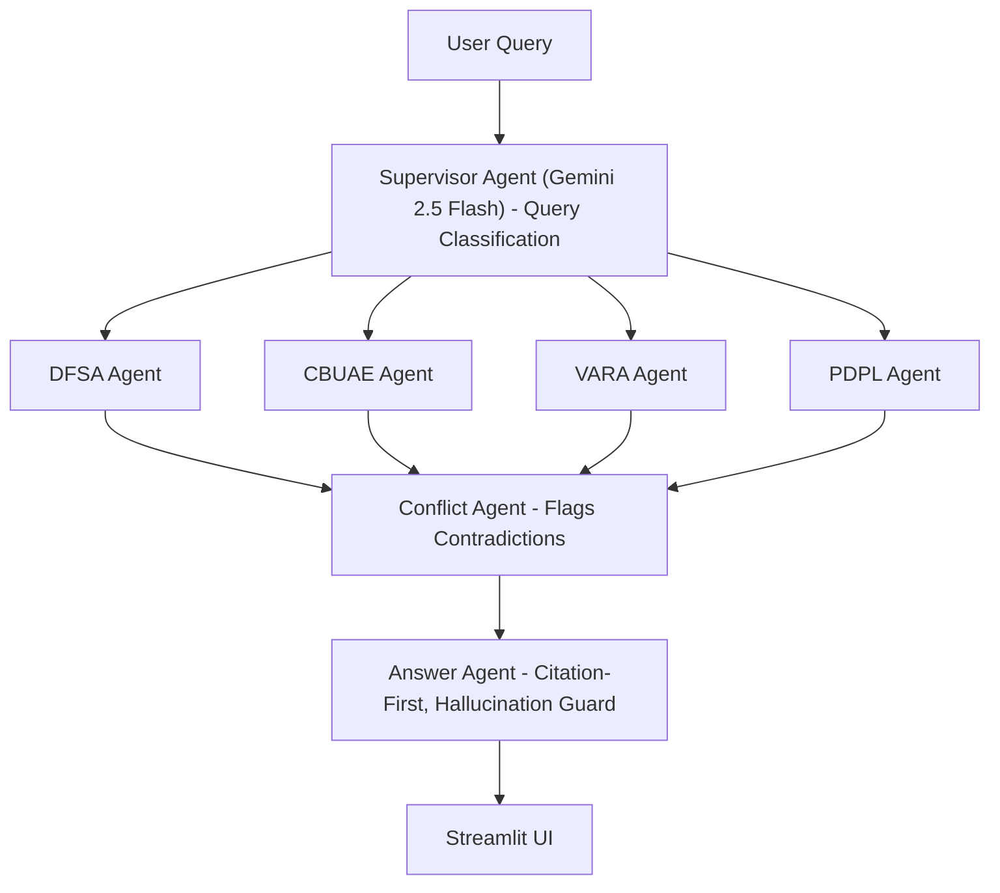

# 🇦🇪 RegRadar UAE — Agentic GCC Regulatory Intelligence Platform

An agentic Retrieval-Augmented Generation (RAG) system that answers UAE/GCC financial compliance questions by reasoning across multiple regulatory bodies (DFSA, CBUAE, VARA, PDPL) — not a single monolithic retriever, but a graph of cooperating specialist agents.

**Live demo:** [add Streamlit URL after deployment]

---

## Problem

Fintech and digital banking teams operating in the UAE must comply simultaneously with overlapping, sometimes conflicting regulatory regimes — DFSA (DIFC financial services), CBUAE (federal banking/payments), VARA (virtual assets, Dubai), and UAE PDPL (data protection). Manually cross-referencing rulebooks is slow and error-prone. Generic RAG chatbots hallucinate citations and can't detect cross-regulator conflicts.

## Architecture




Orchestrated as a stateful graph using **LangGraph**, not a linear chain — enables conditional routing and multi-agent state sharing (`AgentState` TypedDict flows through supervisor → retrieval → conflict → answer nodes).

## Key Design Decisions

| Decision | Rationale |
|---|---|
| Multi-agent routing over single retriever | Regulatory bodies have distinct scope/jurisdiction; a monolithic retriever conflates DIFC-specific DFSA rules with federal CBUAE rules, degrading precision |
| Metadata-filtered Pinecone queries (not separate indexes) | Single index with `reg_body` metadata filter keeps infra simple while still enabling per-agent scoped retrieval |
| Explicit Conflict Agent | Cross-regulatory queries are the highest-value/highest-risk use case; silent merging of contradictory clauses is a compliance liability |
| Citation-first answer generation | Every claim must map to `[doc_name, section, page]`; model instructed to say "Insufficient regulatory basis found" rather than guess — mitigates hallucination in a legal-adjacent domain |
| Gemini 2.5 Flash | Low latency + cost for multi-hop agentic calls (supervisor + N retrievers + conflict + answer = 4-7 LLM calls per query) |

## Tech Stack

- **LLM:** Gemini 2.5 Flash (Google AI SDK)
- **Embeddings:** `gemini-embedding-001`, truncated to 768-dim
- **Orchestration:** LangChain + LangGraph (stateful agent graph)
- **Vector store:** Pinecone (serverless, cosine similarity)
- **Frontend:** Streamlit
- **Source documents:** DFSA Rulebook, CBUAE AML/CFT Regulations, VARA Rulebook, UAE PDPL (Federal Decree Law No. 45 of 2021)

## Features

1. **Multi-agent routing** — Supervisor classifies query into DFSA/CBUAE/VARA/PDPL (single or multi-label), routes to specialist retrievers
2. **Regulatory conflict detection** — dedicated agent cross-examines clauses from 2+ bodies, flags contradictions with explanation
3. **Citation-first answers** — every response cites exact document, article/section, page number; hallucination guard refuses ungrounded claims
4. **Compliance gap analyser** — paste a product feature description → system maps applicable clauses across all 4 bodies and flags MET/UNMET/UNCLEAR per clause + overall risk rating
5. **Admin-gated document ingestion** — password-protected admin panel lets compliance teams upload new regulatory circulars the moment they're issued. Upload triggers the full pipeline (chunk → tag → embed → upsert) in-app, with automatic replacement of stale vectors for re-uploaded documents. Admins can also view indexed documents per regulator and delete outdated ones. This is a deliberate architectural choice over automated web scraping — regulator sites (DFSA/CBUAE/VARA) run bot-detection that blocks headless scraping, and compliance-grade systems arguably should have human verification before a new "regulation" enters the knowledge base anyway.

## Setup

```bash
python3.11 -m venv venv
source venv/bin/activate
pip install -r requirements.txt
cp .env.example .env   # add GEMINI_API_KEY, PINECONE_API_KEY
python -m ingestion.setup_index
python -m ingestion.embed_upload
streamlit run app.py
```

## Limitations & Known Vulnerabilities

**Functional limitations**
- Section/Article extraction uses regex heuristics — works well for numbered clauses, less reliable for prose-style rulebook sections
- Pinecone doesn't support native metadata-only listing; the admin "view documents" feature approximates via a sampled query rather than a guaranteed exhaustive list — acceptable at current corpus size (~1000 chunks), would need a separate document registry at scale
- UAE PDPL has no structured "updates" feed (unlike DFSA/CBUAE/VARA), so it's monitored manually via UAE Data Office announcements rather than through the admin pipeline's upload cadence
- Citation grounding is enforced via prompt instruction, not structurally verified — the model could in principle cite an index that doesn't support a claim; a post-generation citation-verification step (checking cited [n] indices resolve to real context) is a natural v2 addition

**Security considerations (identified, not all mitigated in v1)**
- **Cost-based DoS**: no per-session rate limiting on LLM calls; a public deployment with billing enabled is exposed to abuse-driven cost spikes. Mitigation path: session-level query caps or a lightweight auth gate on the query tabs themselves.
- **Prompt injection**: user queries are concatenated directly into agent prompts without delimiter isolation. A crafted query could attempt to override system instructions. Mitigation path: wrap user input in explicit tags and instruct the model to treat contents as data, not commands.
- **Indirect injection via ingested documents**: admin-uploaded PDFs are not sanitized for embedded adversarial instructions before chunking/embedding. Low risk currently given human-gated uploads, but relevant if ingestion is ever automated.
- **Admin auth is a single shared password**, not per-user accounts — sufficient for a portfolio/demo deployment, not for multi-admin production use.
- **Pinecone API key has full read/write/delete scope** in the deployed app; a leaked key could wipe the index. Production hardening would use a read-only key for the query path and a separate write-scoped key restricted to the ingestion pipeline.

*Documenting these openly is intentional — a defensible compliance-adjacent AI system should have its threat model stated, not implied.*
---
*Built as a demonstration of agentic RAG architecture for GCC RegTech use cases.*